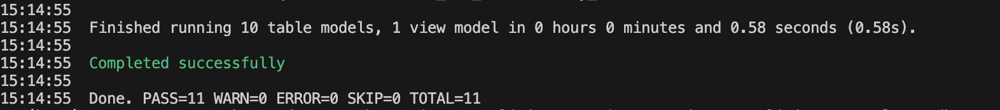
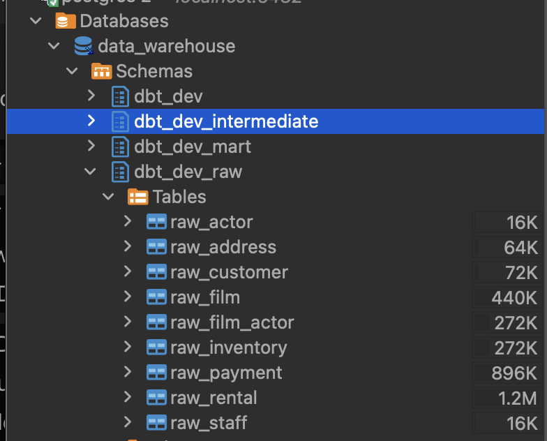
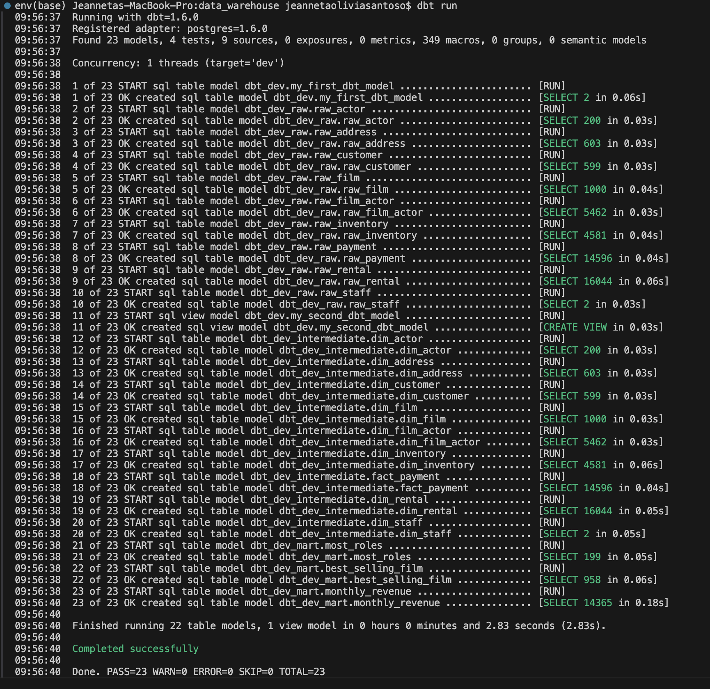
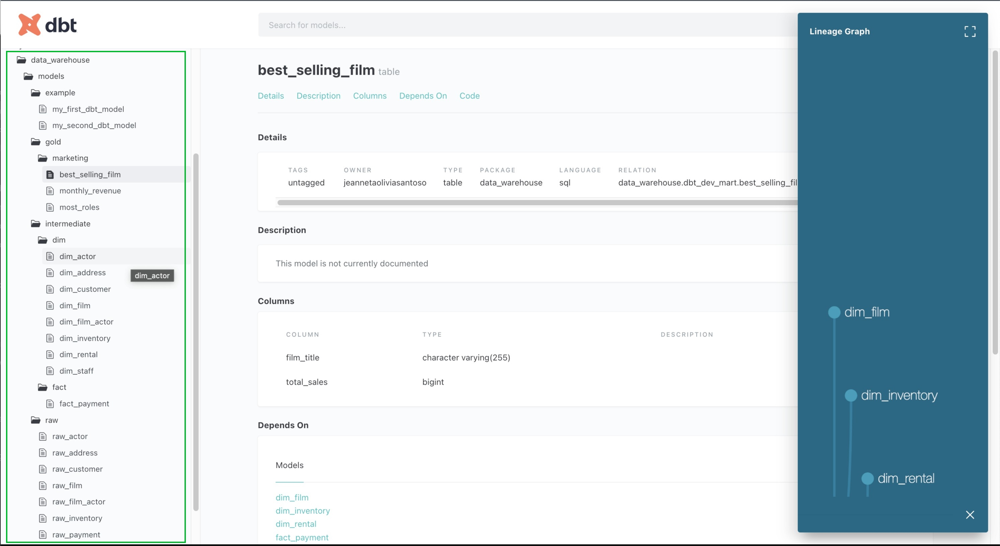
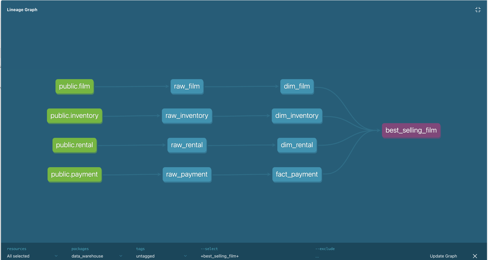

# DBT Hands-On: Build a Data Warehouse with DBT

This guide walks you through setting up a data warehouse using PostgreSQL, DBT, and the DVDRental sample dataset. By the end, you'll create models to answer specific business questions using DBT's modular approach.

## Table of Contents

- [Introduction](#introduction)
- [Getting Started](#getting-started)
- [PostgreSQL Setup](#postgresql-setup)
    - [Using Docker](#using-docker)
    - [Without Docker](#without-docker)
- [DBT Setup](#dbt-setup)
- [Data Modeling](#data-modeling)
    - [Medallion Architecture](#medallion-architecture)
    - [Raw Models](#raw-models)
    - [Intermediate Models](#intermediate-models)
    - [Mart Models](#mart-models)
- [Visualize Your Data](#visualize-your-data)

## Introduction

### What is DBT (Data Build Tool)?

DBT (Data Build Tool) is an open-source command-line tool that helps data analysts and engineers transform data in their warehouses more effectively. It enables you to manage, version, and deploy SQL-based transformations like software code. Think of DBT as a bridge between raw data and the insights needed for decision-making, all while adhering to software development best practices.

### Why Does DBT Exist?

DBT was created to solve challenges in data transformation workflows:

1. **Data is Messy**:
    
    Raw data is often unorganized. DBT helps clean and structure that data to make it useful for analysis.
    
2. **Separation of Storage and Compute**:
    
    Modern data warehouses store data separately from the computing power needed to process it. DBT takes advantage of this by using SQL to transform data directly within the warehouse.
    
3. **Scaling**:
    
    As data grows, DBT allows you to manage and scale transformations efficiently.
    

### Why Should You Use DBT?

Here’s why DBT is great for data transformation:

1. **SQL-Based**:
    
    If you know SQL, you can use DBT right away. No need to learn new programming languages.
    
2. **Collaboration**:
    
    DBT works with Git, so you can collaborate with your team, track changes, and keep versions of your transformations.
    
3. **Modular Approach**:
    
    DBT encourages breaking up transformations into smaller, reusable pieces, making the workflow cleaner and easier to maintain.
    
4. **Automated Documentation**:
    
    DBT automatically generates documentation for your transformations, making it easy for others to understand your work.
    
5. **Testing**:
    
    DBT allows you to test your data for issues, ensuring that your transformations are correct and reliable.
    

DBT makes data transformation easier and more organized by using SQL. It helps you clean, scale, and manage data efficiently, while also promoting collaboration, automation, and testing. It's a must-have tool for modern data workflows.

## Getting Started

**Prerequisites:**

1. Python installed on your local machine.
2. PostgreSQL installed or running via Docker.
3. Basic familiarity with SQL and Python.
4. DBT installed (we'll guide you through the process).

**Sample Data:**

We'll use the [DVDRental](https://www.postgresqltutorial.com/wp-content/uploads/2019/05/dvdrental.zip) dataset, which can be downloaded from [PostgreSQL Sample Database](https://www.postgresqltutorial.com/postgresql-getting-started/load-postgresql-sample-database/).

Heres the ER diagram from the database: https://neon.tech/postgresqltutorial/printable-postgresql-sample-database-diagram.pdf

## PostgreSQL Setup

### Using Docker

1. Run PostgreSQL Container

```sql
docker run --name postgres-test -e PGDATA=/var/lib/postgresql/data \
-e POSTGRES_PASSWORD=postgres \
-e POSTGRES_USER=postgres \
-e POSTGRES_DB=postgres \
-p 5433:5432 \
-v ./dvdrental:/dvdrental \
-v dbt-postgres:/var/lib/postgresql/data \
-d postgres-test:12 
```

1. Restore Sample Data

```sql
docker exec -it <postgres container name> bash
create database data_warehouse
# quit database
\q

# Run in terminal
pg_restore -U postgres -d data_warehouse /dvdrental
```

### Without Docker

1. Open Terminal/PowerShell
2. Create Database

```sql
psql -U postgres
create database data_warehouse;

# quit database
\q

```

1. Restore Data

```sql
pg_restore -U postgres -d data_warehouse /path/to/dvdrental.tar
```

## DBT Setup

1. Create a Virtual Environment and activate Virtual Environment

```sql
python3 -m venv env
source env/bin/activate
```

1. Install DBT libraries: 

```sql
pip3 install dbt-core
pip3 install dbt-postgres
```

1. Initiate DBT project

```sql
dbt init
```

1. Create profiles.yml file using this format

```sql
data_warehouse:
  outputs:
    dev:
      dbname: [dbname]
      host: [host]
      pass: [dev_password]
      port: [port]
      schema: [dev_schema]
      threads: postgres
      type: postgres
      user: [dev_username]
    prod:
      dbname: [dbname]
      host: [host]
      pass: [dev_password]
      port: [port]
      schema: [prod_schemal
      threads: postgres
      type: postgres
      user: [dev_username]
  target: dev
```

For this project, fill out the parameters to connect to the DVDRental database that was created earlier (I don't provide profiles.yml In this project, you can construct your own profiles using the format above):

```sql
data_warehouse:
  outputs:
    dev:
      dbname: data_warehouse
      host: localhost
      pass: [dev_password]
      port: 5432
      schema: dbt_dev
      threads: 1
      type: postgres
      user: postgres
    prod:
      dbname: data_warehouse
      host: localhost
      pass: [dev_password]
      port: 5432
      schema: dbt
      threads: 1
      type: postgres
      user: postgres
  target: dev

```

1. Run debug, if all connections passed then move to next step

```sql
dbt debug
```

## Data Modeling

### Medallion Architecture

Organize your DBT models into three schemas and create 3 new folders inside models folders (Raw, Intermediate, **Mart/Gold**):

1. **Raw Layer:** Replicates the source data.
2. **Intermediate Layer:** Processes data into fact and dimension tables.
3. **Mart Layer:** Answers business questions.

Login to Postgres  and run the following SQL to create schemas:

```sql
create schema dbt_dev_raw;
create schema dbt_dev_intermediate;
create schema dbt_dev_mart;

```

### Raw Models

Define raw models to map source tables directly. For example, create `sources.yml`

```sql
version: 2
sources:
  - name: public
    database: data_warehouse
    schema: public
    tables:
      - name: payment

```

And create raw model for payment named raw_payment.sql

```sql
{{ config(materialized='table', schema='raw') }}

SELECT
    CAST (payment_id as INT) AS payment_id,
    CAST (customer_id as INT) AS customer_id,
    CAST (staff_id as INT) AS staff_id,
    CAST (rental_id AS INT) AS rental_id, 
    amount, 
    payment_date
FROM {{ source('public', 'payment') }}
```

Explanation:

### `{{ config(materialized='table', schema='raw') }}`

- **`{{ config(...) }}`**: This is a DBT-specific function that allows you to set how DBT will handle the result of your SQL query.
- **`materialized='table'`**: This means that DBT will store the query result as a **physical table** in the database (not just a view).
- **`schema='raw'`**: The table will be created in the **`raw`** schema of the database.

### `FROM {{ source('public', 'payment') }}`

- **`{{ source(...) }}`**: This is a DBT function used to refer to an existing table or dataset in the database, usually outside of DBT's model.
- **`'public'`**: This is the schema where the source table (`payment`) is located. In this case, the `public` schema.
- **`'payment'`**: This is the table name within the `public` schema from which you are querying the data.

### 

Continue to create raw model and write it to raw_dev schema using DBT

- payment
- rental
- staff
- customer
- address
- inventory
- film
- film_actor
- actor

After you create all the raw model, dont forget to add the name of the table inside `sources.yml`

```sql

version: 2

sources:
  - name: public
    database: data_warehouse
    schema: public
    tables:
      - name: payment
      - name: rental
      - name: staff
      - name: customer
      - name: address
      - name: inventory
      - name: film
      - name: film_actor
      - name: actor
```

After create this raw models, you will need to run your transformations. Test to run dbt run to build all the models in your project and apply any transformations to the data in your data warehouse. Also Create or update tables/views based on the models you have defined.

```sql
# make sure to cd path/to/your/dbt_project
cd path/to/your/dbt_project

# Run DBT Models
dbt run

# If you want to running specific models
dbt run -s my_model_name
```

After running the models, DBT will provide feedback on whether the models have successfully run or if there were any issues. You'll see an output like:



If any errors occur during execution, DBT will show the error messages, and you can troubleshoot based on the details provided.

Check the tables that you created on your db



### Intermediate Models

1. Create intermediete model and write it to intermediete_dev schema using DBT
    - fact_payment
    - dim_rental
    - dim_staff
    - dim_customer
    - dim_address
    - dim_inventory
    - dim_film
    - dim_film_actor
    - dim_actor

Process raw data into structured fact and dimension tables. Examples:

1. Fact Payment

```sql
{{ config(materialized='table', schema='intermediate') }}

SELECT
    payment_id,
    customer_id,
    staff_id,
    rental_id, 
    amount, 
    payment_date
FROM {{ ref('raw_payment') }}
```

Expanation:

### `FROM {{ ref('raw_payment') }}`

- **`{{ ref(...) }}`**: This is a special DBT function that creates a reference to another DBT model. It allows you to refer to another model that has been built or defined in DBT.
- **`'raw_payment'`**: This is the name of a DBT model that you want to reference. The `ref()` function will ensure that DBT knows the correct order in which the models should be built (i.e., it will ensure `raw_payment` is built before the model that references it).

1. Dimension Customer

```sql
{{ config(materialized='table', schema='intermediate') }}

SELECT
    customer_id,
    store_id, 
    first_name,
    last_name,
    email,
    address_id,
    activebool,
    create_date,
    last_update,
    active
FROM {{ ref('raw_customer') }}
```

### Mart Models

Answer business questions with aggregated or analytical models and create mart model and write it to mart_dev schema using DBT

### Question 1: How many monthly total revenue ?

In this case I put the model inside gold/marketing folder

```sql
{{ config(materialized='table', schema='mart') }}

SELECT
    DATE_TRUNC('month', payment_date) AS month,
    SUM(amount) AS total_revenue
FROM {{ ref('fact_payment') }} fp
LEFT JOIN {{ ref('dim_rental') }} dr on fp.rental_id = dr.rental_id
GROUP BY payment_date
```

### Question 2: What is the best selling film ?

```sql
{{ config(materialized='table', schema='mart') }}

SELECT 
    df.title as film_title, 
    count(fp.payment_id) as total_sales
FROM {{ ref('fact_payment') }} fp
LEFT JOIN {{ ref('dim_rental') }} dr on fp.rental_id = dr.rental_id 
LEFT JOIN {{ ref('dim_inventory') }} di on dr.inventory_id = di.inventory_id 
LEFT JOIN {{ ref('dim_film') }} df on df.film_id = di.film_id 
GROUP BY df.title
ORDER BY total_sales desc
```

### Question 3: Who is the actor who plays the most roles in films ?

```sql
{{ config(materialized='table', schema='mart') }}

SELECT
    CONCAT(da.first_name, ' ', da.last_name) AS actor_name,
    COUNT(dfa.film_id) AS total_films
FROM {{ ref('dim_film_actor') }} dfa
LEFT JOIN {{ ref('dim_actor') }} da ON dfa.actor_id = da.actor_id
GROUP BY actor_name
ORDER BY total_films DESC
```

After you build all the models, make sure to run all the model using dbt run

```sql
dbt run
```

If everything is successful, DBT will create tables or views in your data warehouse as per the models you defined



### Visualize Your Data

1. Generate DBT Docs

```sql
dbt docs generate
```

1. Serve the Docs Locally (usually it will use port 8000)

```sql
dbt docs serve
```

Change the port if the port is already used

```sql
dbt docs serve --port 8001
```

You can view all your model created in the UI 




